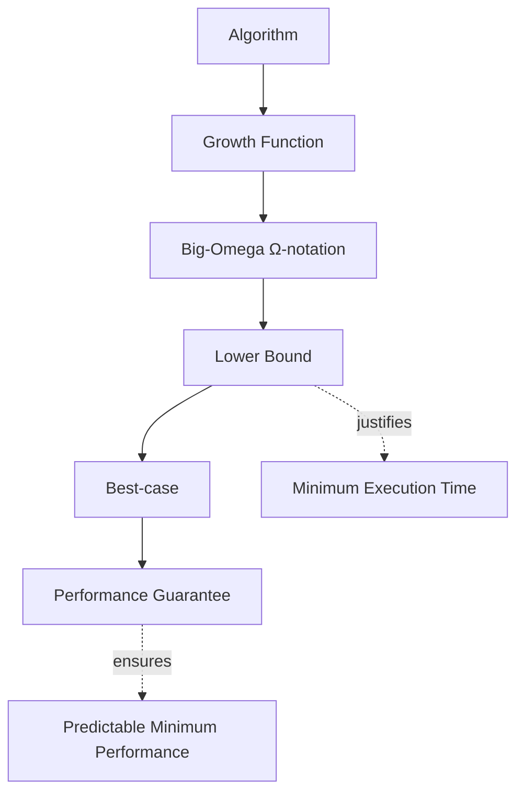
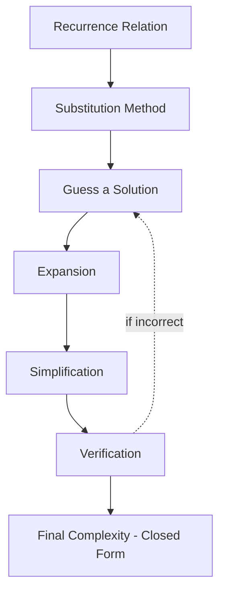

# CSA06 - Design and Analysis of Algorithms
## Assessment Tool 2 – Concept Mapping
**CO1:** Determine algorithm efficiency using asymptotic notations and mathematical techniques including Master Theorem and substitution method.

---

## Q1. Concept Map: Algorithm → Growth Function → Big-Omega → Lower Bound → Best-case

### Concept Map

### 1. How Lower Bound Represents Minimum Execution Time

- Every algorithm's running time depends on input size (n), captured by its **growth function**, f(n).
- **Big-Omega (Ω)** notation formally expresses a **lower bound** — it guarantees that the algorithm's running time will *never be less than* a certain rate of growth, for sufficiently large n.
- Mathematically: `f(n) = Ω(g(n))` means there exist positive constants `c` and `n₀` such that `f(n) ≥ c·g(n)` for all `n ≥ n₀`.
- This lower bound directly corresponds to the algorithm's **best-case** behavior — the minimum amount of work the algorithm must do, no matter how favorable the input is.

### 2. Extending the Map with Performance Guarantee

- The **best-case (Ω)** analysis gives a **performance guarantee**: it tells us the algorithm will take *at least* this much time, establishing a floor on execution time that cannot be beaten even under ideal conditions.

### 3. Why Best-Case Analysis Is Useful

- Helps identify the **most optimistic performance** an algorithm can achieve (e.g., searching for an element already at the first position).
- Useful in scenarios where inputs are frequently near-ideal (e.g., nearly sorted data for insertion sort).
- Assists in **comparing algorithms' minimum guarantees**, not just their worst-case behavior.
- Provides a complete picture when combined with average-case (Θ) and worst-case (O) analysis.

### 4. Contribution to Overall Performance Understanding

- Combining **Ω (lower bound), Θ (tight bound), and O (upper bound)** gives a full 360° view of an algorithm's behavior across all input conditions.
- Best-case analysis prevents **over-pessimistic assumptions** and helps developers understand the full performance spectrum — from best to worst — enabling better algorithm selection for specific real-world use cases.

---

## Q2. Concept Map: Recurrence Relation → Substitution Method → Expansion → Simplification → Final Complexity

### Concept Map

### 1. Step-by-Step Transformation of Recurrence into Closed Form

| Step | Action | Description |
|------|--------|-------------|
| 1 | **Recurrence Relation** | Start with the recursive definition, e.g., `T(n) = T(n−1) + n` |
| 2 | **Guess** | Hypothesize a closed-form solution based on the recurrence's structure (e.g., guess `T(n) = O(n²)`) |
| 3 | **Expansion** | Repeatedly substitute the recurrence into itself to reveal a pattern: `T(n) = T(n−1)+n = T(n−2)+(n−1)+n = ...` |
| 4 | **Simplification** | Sum the resulting series and simplify algebraically into a closed-form expression |
| 5 | **Verification** | Prove the guess correct using mathematical induction (base case + inductive step) |
| 6 | **Final Complexity** | Express the result in asymptotic notation (e.g., `Θ(n²)`) |

### 2. Extending the Map with Guess and Verification Nodes

- **Guess:** Before expansion, an initial hypothesis about the solution's form is made — often based on intuition, pattern recognition, or similarity to known recurrences.
- **Verification:** After deriving a closed form, it must be **proven correct** using **mathematical induction** — substituting the guessed formula back into the original recurrence to confirm it satisfies the relation for all n. If verification fails, the guess is refined and the process repeats.

### 3. How Substitution Helps Solve Non-Standard Recurrences

- Many recurrences don't fit the standard form required by the **Master Theorem** (e.g., `T(n) = T(n−1) + n`, or recurrences with non-constant coefficients).
- The substitution method is **general-purpose** — it works by direct algebraic manipulation and mathematical proof, rather than relying on fixed templates.
- It's especially useful for recurrences with **irregular splitting**, **additive terms**, or **non-polynomial growth**, which the Master Theorem cannot handle.

### 4. How This Structured Approach Improves Understanding

- Breaking the process into **Guess → Expand → Simplify → Verify** builds a **rigorous, step-by-step reasoning habit** rather than relying on memorized formulas.
- It deepens understanding of **why** an algorithm has a particular complexity, not just **what** the complexity is.
- This method reinforces the connection between **recursive algorithm design** and **mathematical proof techniques**, which is foundational for analyzing more advanced algorithms (e.g., divide-and-conquer strategies).
